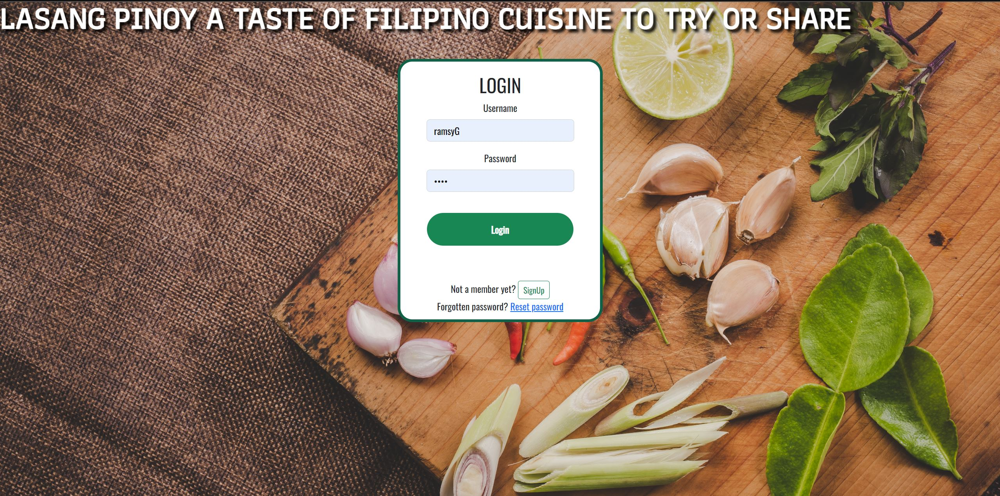

# FILIPINO RECIPES API

 

## Project Summary

### Project Context

LASANG PINOY API is a mobile responsive website for cooks or ordinary people who want to cook or share Filipino food recipes the website has a recipe search engine makes easier to find recipes for recipes that fits your budget and can simply search title or find recipes that match their needs. Being motivated from watching different foreign taste Filipino foods in Philippines the website could provide and teach the users to cook and taste Filipino delicacies in the comfort of their own home.

### Project Goals

The database goal is to provide the user an easy way to find and share their own recipes by putting ingredients and instruction that other people can access to for them to try also to promote Filipino delicacies.

the database can be accessed [here](https://engroliver.github.io/Oliver-Assignment-1/).

### Justification for the project

To provide an convenient way to discover, find and monitor their callorie intakes while exploring filipino culture with their exotic food. At the comfort of their own home they do not need to go to philippines anymore to try and taste filipino delicacies.

### FEATURES

* Add new recipe to the data by /recipes/add

* Get recipe by title

* Get all Recipes by course

* Get Recipes by cost

* update recipe by /recipes/:recipeID

* delete recipe

* Register account

* Login account

### Limitations & Bugs
1. I tried to pud upload-care features to have some picture data in mongodb unfortunetly errors show.

2. I tried to put 3 type of filter by searchbar,checkbos and dropdown but unfortunetly only searchbar works.

3. tried to put form validation in addrecipe,login and signup before submitting form but failed to correct errors. 

### Features pending implementing
1. Could someday put add to favorite feature and display on profile tab
2. Include Jwt token feature in localStorage 

## Technologies Used
1. VueJs 
    - used to create  front end framework for the single page web app 

2. MongoDb Express 
    - used to store data for the API

3. [Bootstrap v5.1](https://getbootstrap.com/docs/5.1/getting-started/introduction/) 
    - Used to build and customize the web application by using style/templates and its components     

4. [pexels](https://www.pexels.com/) 
    - Used for background application of web page 

 5. Axios 
    - Used to extract data from mongoDB

 6. vue-router 
    - Used to create routes and pages for the web page   

 ## Testing
 
 | Test Case #  | Test Case Description  | Test steps | Expected Result       |
 | :------------|:---------------------- |:---------- |:--------------------- |
 |1 | To check if Signup for an account works | Fill-up form to signup | Redirected page to login page and checking new account on mongodb compass |
 |2 | To check if Login youre account works| input correct username and password correct and input false username and password| Redirected page to home page if username and password is correct and stayed on loginpage if invalid username and password |
 |3 | To check that filtering in search bar works | input title of recipe you want to search | cards only displays matching the criteria in filter.|
 |4 | to check if navlink-works |Clicking on Navlinks to redirect using vue router |Redirecting to page works when each Navlink is clicked. including log-out |
 |5 | to check if show detail works |1. Clicking on show button  2.Clicking X close button on recipe detail |1.User will be redericted to show Recipedetail 2.User will be redirected back to home page if close X button is clicked|
 |5 | Testing Adding new Recipe | 1. Fill up form in add recipe  2. Leave some input blank | Redirected to Home page and a new recipe with uniqe Id will be shown on Mongodb compass|
 |6 | Testing if edit recipe works | 1. click on edit button   2. you would see in the recipe form with included original data 3. edit the part were you want to edit | 1. User will be Redirected to Home page   2. you would see in the homepage that under recipe detail that the recipe has been changed to whatever you inuput  | 
 |7 | Testing to Delete recipe | 1. Click on show button for the recipe to delete    2. under recipe details click delete button| 1. User is redirected to homepage and the selected recipe to delete will be deleted should disappear from both web page and mongodb. |

### CREDITS
1. https://panlasangpinoy.com

    -Recipe Source for the project
